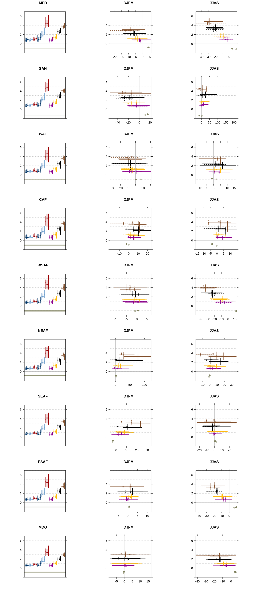
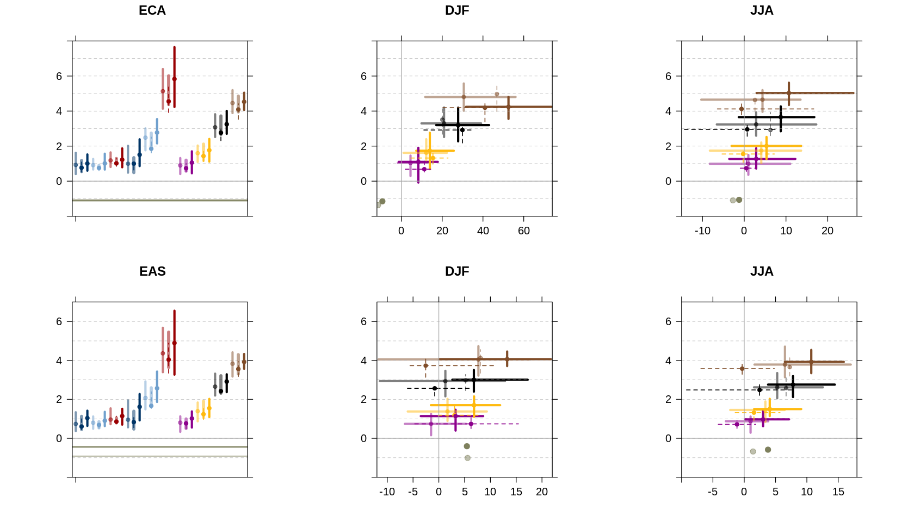
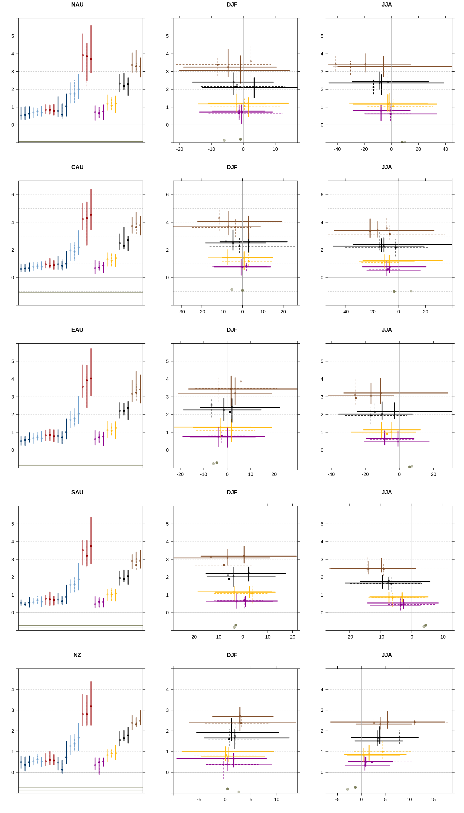

Chapter 99: AR7 WGI Figure Examples
====================================

## Contents

- [Contents](#contents)
- [Getting started](#getting-started)
- [Figures](#figures)
- [Disclaimer](#disclaimer)

## Getting started

This repository presents three examples based on figures from the AR6 report. Each example demonstrates a different approach to generating scientific figures, highlighting varying levels of complexity, reproducibility, and code organization.

## Figures

| Figure Folder | Preview | Figure Title |
|---------------|---------|--------------|
| [fig99_exp01](./fig99_exp01/) |  | **Example 1 – Independent, final-data figure: A standalone figure generated directly from final dataset with simple plotting scripts.** Comparison between simulated annual precipitation changes and pollen-based reconstructions during the mid-Holocene (~6000 years ago). |
| [fig99_exp02](./fig99_exp02/) |  | **Example 2 – Independent, Self-contained example: Packaged scripts that downloads data, processes it, and generates the figure end-to-end.** Phytoplankton dynamics in the ocean. |
| [fig99_exp03_01](./fig99_exp03_01/) |  | **Example 3 – Shared code and data: Part of a multi-figure set built from shared datasets and code.** Regional changes over land in annual mean surface air temperature and precipitation relative to the 1995–2014 baseline for Africa (with warming since the 1850–1900 pre-industrial baseline shown as an offset). |
| [fig99_exp03_02](./fig99_exp03_02/) |  | **Example 3 – Shared code and data** Regional changes over land in annual mean surface air temperature and precipitation relative to the 1995–2014 baseline for Asia (including pre-industrial offset). |
| [fig99_exp03_03](./fig99_exp03_03/) |  | **Example 3 – Shared code and data** Regional changes over land in annual mean surface air temperature and precipitation relative to the 1995–2014 baseline for Australasia (including pre-industrial offset). |

## Disclaimer
Please note that figures in this repository may differ from those in the published version due to the editorial process. The repository contains the latest available versions prior to publication.
