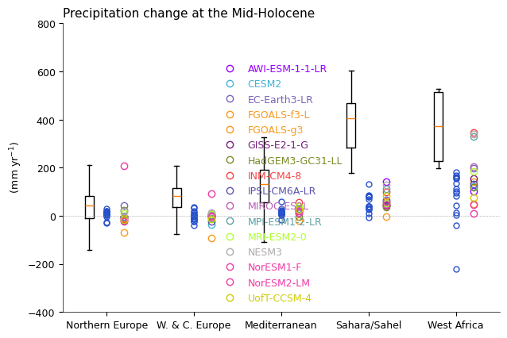
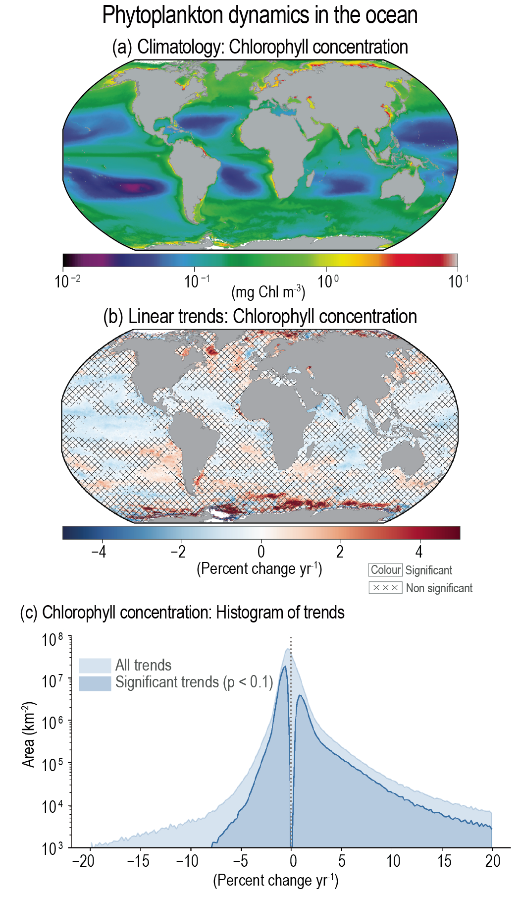

Chapter 99: chapter title
====================================

## Contents

- [Contents](#contents)
- [Getting started](#getting-started)
- [Figures](#figures)
- [Disclaimer](#disclaimer)

## Getting started

Describe the scope of the repository, how figures are organised, how to set up the environment, and how to reproduce outputs. It should also link to the figure folders (figXX_YY/) and any shared resources (e.g., src/, data/, env/).

## Figures

Describe the figures in this chapter. Mention what each figure represents.

Example:

| Figure Folder | Preview | Figure Title |
|---------------|---------|-------------|
| [fig_exp01](./figures/fig_exp01/) |  | Comparison between simulated annual precipitation changes and pollen-based reconstructions in the mid-Holocene (6000 years ago) |
| [fig_exp02](./figures/fig_exp02/) | | Phytoplankton dynamics in the ocean |
| figure folder name | address to figure to preview  | Title of Figure |
|  |  |  |
|  |  |  |

## Disclaimer
Please note that figures in this repository may differ from those in the published version due to the editorial process. The repository contains the latest available versions prior to publication.
